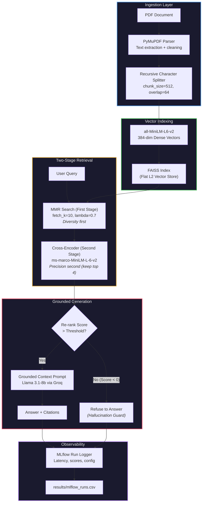

<div align="center">

# RAG Document Intelligence Chatbot

**Production-style Retrieval-Augmented Generation (RAG) pipeline with two-stage retrieval and experiment tracking**

[](https://python.org)
[](https://langchain.com)
[](https://github.com/facebookresearch/faiss)
[](https://groq.com)
[](https://mlflow.org)
[](https://colab.research.google.com/github/AnshumanJ28/rag-document-chatbot/blob/main/notebook/rag_chatbot.ipynb)
[](LICENSE)

<br/>

*Two-Stage Retrieval (MMR + Cross-Encoder) · Hallucination Guard · Latency Tracking · MLflow Observability*

Built in Google Colab. Focuses on retrieval quality, diversity, and experiment tracking — not just wrapping an LLM.

<br/>

[Architecture](#architecture) · [Results](#results) · [Pipeline Decisions](#pipeline-design-decisions) · [Quickstart](#quickstart)

---

</div>

## Table of Contents

<details>
<summary><b>Click to expand</b></summary>

1. [Demo](#demo)
2. [Results](#results)
3. [Architecture](#architecture)
4. [Tech Stack](#tech-stack)
5. [Repo Structure](#repo-structure)
6. [Quickstart](#quickstart)
7. [Pipeline Design Decisions](#pipeline-design-decisions)
8. [Configuration](#configuration)
9. [Limitations & Future Work](#limitations--future-work)
10. [License](#license)

</details>

---

## Demo


> [!NOTE]
> **Interface layout:** The left panel provides a conversational chat interface for asking document questions, while the right panel displays live source citations with corresponding cross-encoder re-rank scores for complete query observability.

---

## Results

All test queries are logged via MLflow to evaluate latency and relevance:

| Question | Latency | Top Rerank Score | Answer Length | Status |
|:---|:---:|:---:|:---:|:---:|
| What is the capital of Japan? | 0.59s | -11.06 | 73 chars | **Hallucination Blocked** |
| How does chunking strategy affect retrieval? | 0.64s | 7.21 | 354 chars | **Answered & Cited** |
| What is MMR and why is it used in retrieval? | 0.69s | -1.10 | 254 chars | **Answered & Cited** |
| Explain the difference between FAISS index types? | 0.77s | -1.68 | 301 chars | **Answered & Cited** |
| What evaluation metrics are used for RAG systems? | 0.81s | 7.85 | 183 chars | **Answered & Cited** |

> [!IMPORTANT]
> **Key Observation:** The out-of-document query (Japan) returned a top re-rank score of **-11.06** and successfully triggered the hallucination guard. On-topic queries scored **7+** and received accurate, grounded answers. The cross-encoder's score distribution acts as a reliable filter for out-of-scope questions.

Full run logs: [`results/mlflow_runs.csv`](results/mlflow_runs.csv)

---

## Architecture

### End-to-End RAG Pipeline



### Two-Stage Retrieval Logic


---

## Tech Stack

| Layer | Tool | Purpose |
|:---|:---|:---|
| **PDF Parsing** | PyMuPDF (fitz) | High-speed document text extraction and structural cleaning |
| **Chunking** | LangChain `RecursiveCharacterTextSplitter` | Intelligently splits document text preserving paragraphs |
| **Embeddings** | `all-MiniLM-L6-v2` | Computes dense 384-dimensional semantic text vectors |
| **Vector Store** | FAISS | In-memory indexing and fast similarity search |
| **Re-ranking** | `ms-marco-MiniLM-L-6-v2` | Cross-encoder joint scoring for high-precision retrieval |
| **LLM** | Llama 3.1-8b-instant via Groq API | Grounded response generation |
| **Orchestration** | LangChain | Pipelines and component integration |
| **Observability** | MLflow | Structured experiment tracking, latency, and parameter logging |
| **UI Layer** | Gradio | Conversational web interface with split panel for citations |
| **Runtime** | Google Colab (T4 GPU free-tier) | Cloud development and execution host |

---

## Repo Structure

```
rag-document-chatbot/
├── notebook/
│   └── rag_chatbot.ipynb        ← Core Colab notebook containing full pipeline
├── results/
│   └── mlflow_runs.csv          ← Exported MLflow run logs and evaluation metrics
├── sample_data/
│   └── sample_rag_test.pdf      ← Automatically generated sample PDF for testing
├── requirements.txt             ← Python dependencies
└── README.md
```

---

## Quickstart

### 1. Clone the repository

```bash
git clone https://github.com/AnshumanJ28/rag-document-chatbot
cd rag-document-chatbot
pip install -r requirements.txt
```

### 2. Open in Google Colab

Click the badge above or upload `notebook/rag_chatbot.ipynb` to [colab.research.google.com](https://colab.research.google.com).

### 3. Add Environment Secrets

In Colab, click the key icon (left sidebar) and add the following keys:

| Secret Name | Purpose | Where to Get It |
|:---|:---|:---|
| `GROQ_API_KEY` | Generative LLM inference | [console.groq.com](https://console.groq.com) *(free)* |
| `GITHUB_TOKEN` | Version control integration | GitHub → Settings → Developer Settings → Tokens |
| `NGROK_AUTHTOKEN` | Tunneling Gradio UI *(optional)* | [ngrok.com](https://ngrok.com) *(free)* |

### 4. Run Notebook Cells

- The notebook generates a sample PDF automatically on execution so you can test immediately.
- You can upload your own PDF in the UI upload block.
- The Gradio UI cell will output a public, shareable link to open the dashboard.

---

## Pipeline Design Decisions

### Why MMR Before Re-ranking?

Pure similarity search returns redundant chunks — multiple segments saying the same thing from adjacent pages. Maximal Marginal Relevance (MMR) enforces diversity during the initial fetch (selecting 10 diverse candidates), and then the cross-encoder re-ranks those 10 diverse candidates for precision, keeping the top 4. This is a classic two-stage retrieval strategy: **diversity first, precision second**.

### Why Cross-Encoder Re-ranking?

Bi-encoders (used for initial embedding and FAISS search) encode the query and document independently. While fast, they miss fine-grained cross-attention signals. Cross-encoders take the query-document pair as joint input, giving much higher relevance precision. Because they are slower, they are unsuitable for searching millions of documents, but ideal for re-ranking a small candidate set.

### Why the Hallucination Guard Matters?

The system prompt explicitly instructs the LLM to answer only from the provided context. If a user asks a question not covered by the document (such as the Japan question), the cross-encoder returns a top re-rank score of less than zero across all chunks. This signals that nothing relevant was retrieved, and the pipeline halts generation, outputting a standard refusal message instead of letting the model hallucinate.

---

## Configuration

All key hyperparameters reside in `RAGConfig` at the top of the notebook:

```python
@dataclass
class RAGConfig:
    chunk_size: int        = 512
    chunk_overlap: int     = 64
    top_k_retrieval: int   = 10
    top_k_rerank: int      = 4
    llm_model: str         = "llama-3.1-8b-instant"
    temperature: float     = 0.2
```

> [!TIP]
> You can tune these hyperparameters and run evaluations to see how they impact latency and retrieval scores. All runs will be logged and compared side by side in the MLflow UI.

---

## Limitations & Future Work

- [ ] **Conversational Memory:** Add multi-turn tracking (e.g. LangChain `ConversationBufferMemory`) to support follow-up questions
- [ ] **Multi-Document Support:** Integrate a persistent vector database (e.g. Pinecone/Chroma) to query across document collections
- [ ] **Offline Inference:** Add support for running local Ollama servers to avoid API rate limits on the free tier
- [ ] **Structured RAGAS Evaluation:** Add reference-based metrics (faithfulness, answer relevancy) to the MLflow dashboard for automated validation

---

## License

MIT — see [`LICENSE`](./LICENSE).

---

<div align="center">

### Grounded Document QA

*Recursive Chunking · MMR Diversity · Cross-Encoder Re-ranking · Hallucination Guard · MLflow Tracking*

**Retrieve with high precision. Generate with absolute grounding.**

<br/>

Star this repo if you found it interesting!

---

*Made by [Anshuman](https://github.com/AnshumanJ28)*

</div>
